## Program Schedule
Workshop Location: TBA <a href="https://link-for-slides">slides</a>
 
Poster Session Location: TBA
  
TBA Pacific Daylight Time

<ul>
<li> 08:00–08:45 - Opening Remarks </li>
<li> 08:45–09:15 - Invited Talk: {Name}. {Topic}. </li>
<li> 09:15–09:45 - Invited Talk: {Name}. {Topic}. </li>
<li> 09:45–10:30 - Contributed Talk: {Topic}. </li>
<li> 10:30–11:00 - Invited Talk: {Name}. {Topic}. </li>
<li> 11:00–12:00 - Panel Discussion: {Topic}. </li>
<li> 12:00–13:00 - Poster Session </li>
<li> 13:00–13:30 - Invited Talk: {Name}. {Topic}. </li>
<li> 13:30–14:00 - Invited Talk: {Name}. {Topic}. </li>
<li> 14:00–14:30 - Invited Talk: {Name}. {Topic}. </li>
<li> 14:30–15:30 - Poster Session </li>
<li> 15:30–15:45 - Coffee Break </li>
<li> 15:45–16:15 - Invited Talk: {Name}. {Topic}. </li>
<li> 16:15–16:45 - Invited Talk: {Name}. {Topic}. </li>
<li> 16:45–17:45 - Panel Session 2 </li>
<li> 17:45–18:00 - Closing Remark and Award Ceremony </li>
</ul>

## Invited Speakers

<table>
  <tbody>
    <tr>
      <td width="25%"><a href="https://www.mit.edu/~jda/">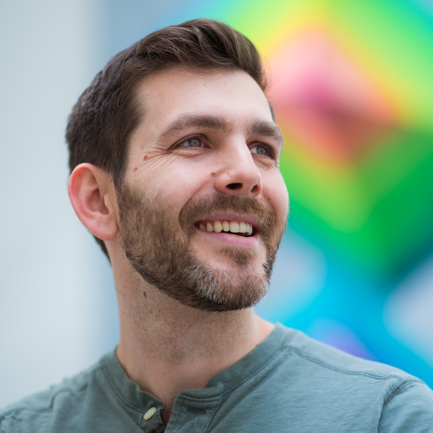</a></td>
      <td width="25%"><a href="https://profiles.stanford.edu/michael-bernstein">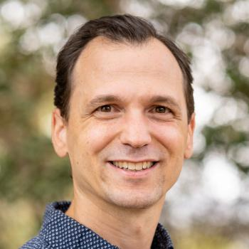</a></td>
      <td width="25%"><a href="https://www.cs.princeton.edu/~danqic/">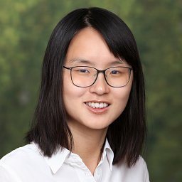</a></td>
      <td width="25%"><a href="https://ai.stanford.edu/~cbfinn/">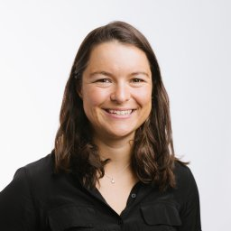</a></td>
    </tr>
    <tr>
      <td><a href="https://www.mit.edu/~jda/">Jacob Andreas (MIT)</a></td>
      <td><a href="https://profiles.stanford.edu/michael-bernstein">Michael Bernstein (Stanford)</a></td>
      <td><a href="https://www.cs.princeton.edu/~danqic/">Danqi Chen (Princeton)</a></td>
      <td><a href="https://ai.stanford.edu/~cbfinn/">Chelsea Finn (Stanford)</a></td>
    </tr>
    <tr>
      <td width="25%"><a href="https://people.eecs.berkeley.edu/~jegonzal/">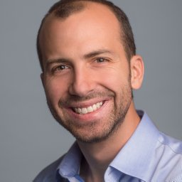</a></td>
      <td width="25%"><a href="https://www.cis.upenn.edu/~danroth/">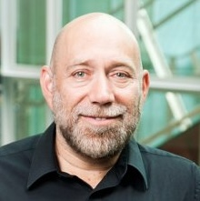</a></td>
      <td width="25%"><a href="http://web.cse.ohio-state.edu/~huansun/">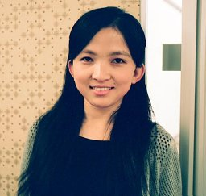</a></td>
      <td width="25%"><a href="https://taoyds.github.io/">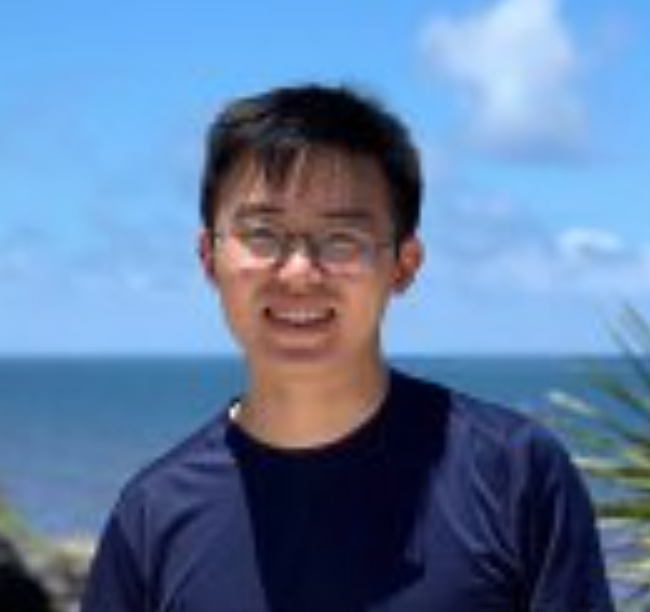</a></td>
    </tr>
    <tr>
      <td><a href="https://people.eecs.berkeley.edu/~jegonzal/">Joseph E. Gonzalez (Berkeley)</a></td>
      <td><a href="https://www.cis.upenn.edu/~danroth/">Dan Roth (University of Pennsylvania)</a></td>
      <td><a href="http://web.cse.ohio-state.edu/~huansun/">Huan Sun (Ohio State University)</a></td>
      <td><a href="https://taoyds.github.io/">Tao Yu (Hong Kong University)</a></td>
    </tr>
  </tbody>
</table>

 

## Organizing Committee

<table>
  <tbody>
    <tr>
      <td width="25%"><a href="https://akariasai.github.io/">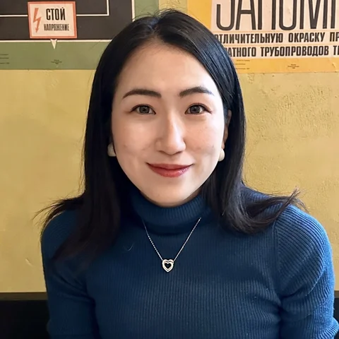</a></td>
      <td width="25%"><a href="https://zorazrw.github.io/">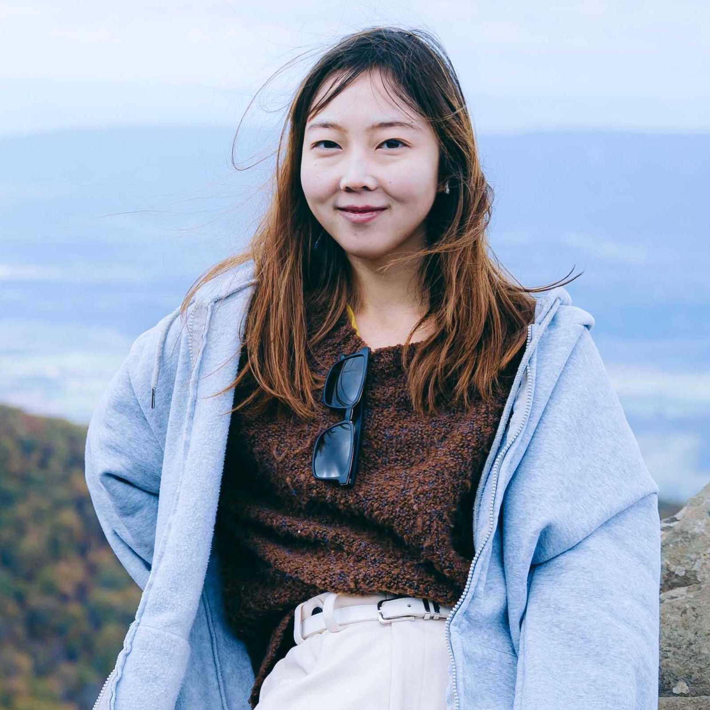</a></td>
      <td width="25%"></td>
    </tr>
    <tr>
      <td><a href="https://akariasai.github.io/">Akari Asai (University of Washington)</a></td>
      <td><a href="https://zorazrw.github.io/">Zora Zhiruo Wang (Carnegie Mellon University)</a></td>
      <td><a href="https://swj0419.github.io/">Weijia Shi (University of Washington)</a></td>
    </tr>
    <tr>
      <td width="25%"></td>
      <td width="25%"><a href="https://www.alanesuhr.com/">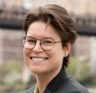</a></td>
      <td width="25%"><a href="https://xiangyue9607.github.io/">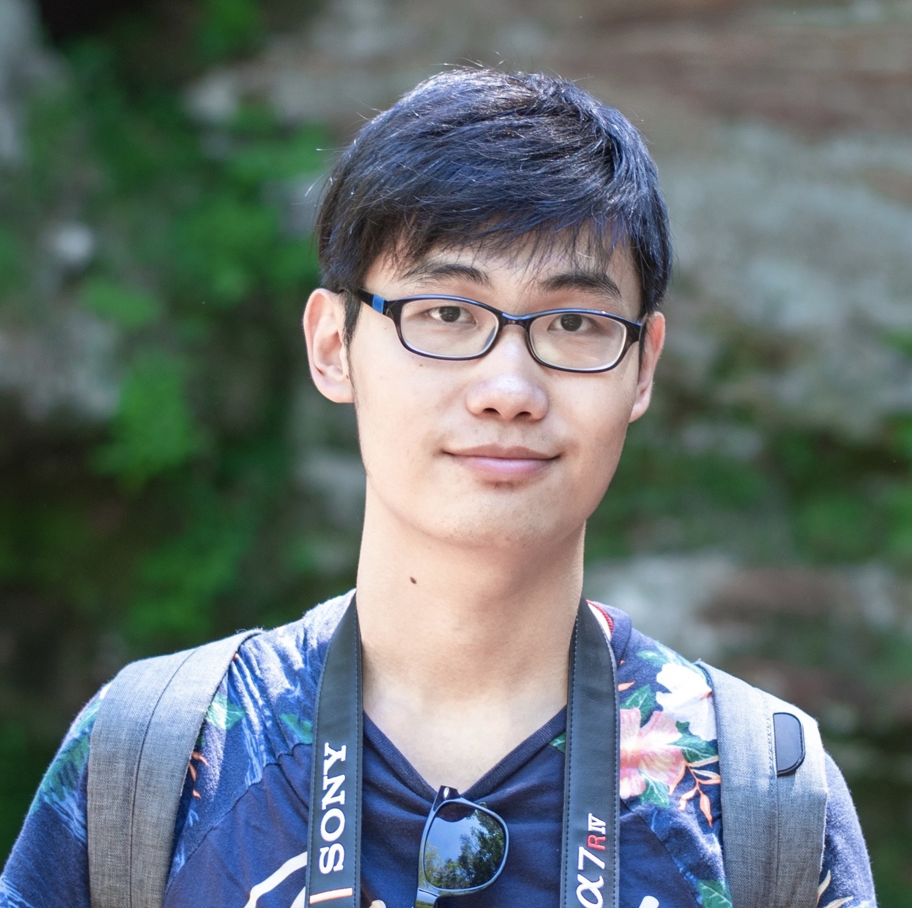</a></td>
    </tr>
    <tr>
      <td><a href="https://cs.stanford.edu/~myasu/">Michihiro Yasunaga (Meta)</a></td>
      <td><a href="https://www.alanesuhr.com/">Alane Suhr (Berkeley)</a></td>
      <td><a href="https://xiangyue9607.github.io/">Xiang Yue (Carnegie Mellon University)</a></td>
    </tr>
  </tbody>
</table>
